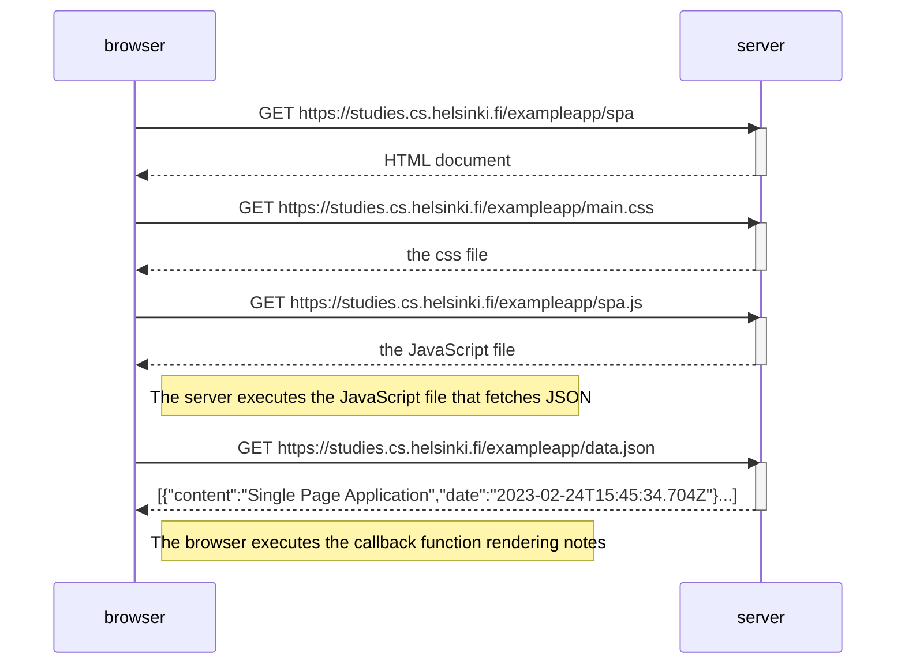

```mermaid
    sequenceDiagram
        participant browser
        participant server
        
        browser->>server: GET https://studies.cs.helsinki.fi/exampleapp/spa
        activate server
        server-->>browser: HTML document
        deactivate server
        
        browser->>server: GET https://studies.cs.helsinki.fi/exampleapp/main.css
        activate server
        server-->>browser: the css file
        deactivate server

        browser->>server: GET https://studies.cs.helsinki.fi/exampleapp/spa.js
        activate server
        server-->>browser: the JavaScript file
        deactivate server

        Note right of browser: The server executes the JavaScript file that fetches JSON
        
        browser->>server: GET https://studies.cs.helsinki.fi/exampleapp/data.json
        activate server
        server-->>browser: [{"content":"Single Page Application","date":"2023-02-24T15:45:34.704Z"}...]
        deactivate server    

        Note right of browser: The browser executes the callback function rendering notes
```